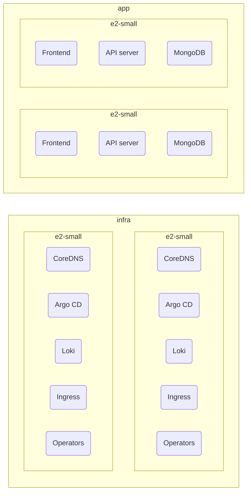

# ADR 1: Separate infrastructure and application workloads into dedicated node pools

## Context

The original plan had been to deploy a single node pool to run all of our application
and infrastructure workloads, but the pilot deployment, a single e2-small node, was
insufficient to run the basic infrastructure components (insufficient CPU resulted in
the scheduler being unable to place CoreDNS pods).
Further, in a production setting, it would seem logical to separate these workloads to
protect system-integral workloads from application activity (i.e. to mitigate
noisy-neighboring CoreDNS, kube-proxy, etc.).

## Decision

The cluster will use multiple node pools as follows (topology as of 2026-8-11):

- `infra`: 2 x e2-small nodes for running infrastructure workloads, such as Argo CD, etc.
- `app`: 2 x e2-small nodes for running application workloads

> The `app` node pool also has two nodes for practice distributing workloads across nodes.
> To mitigate costs, we're using e2-small.

Node taints and labels are managed declaratively through the OpenTofu resources.

## Consequences

### Positive

- Improved workload isolation
- More representative of real GKE operations
- Declarative and reproducible node configuration

### Negative

- Introduces operational overhead
- Higher cost than a single-node cluster
