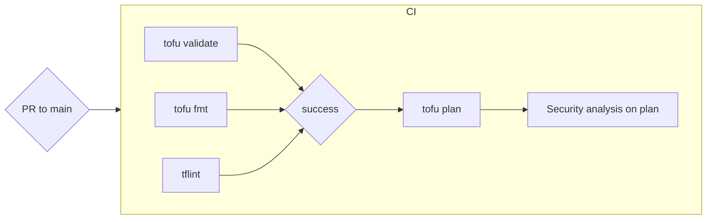
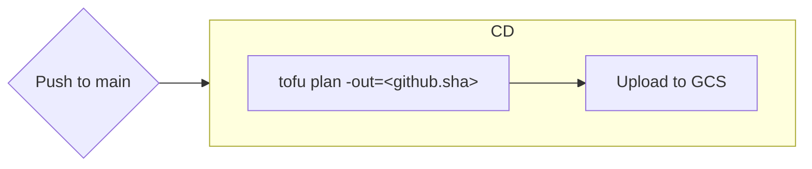
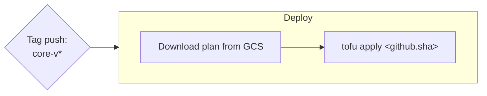

# CI/CD

Infrastructure changes are promoted through an immutable plan artifact.
Upon push to `main`, an immutable plan artifact is uploaded to GCS during CD, and is downloaded and executed during deployment on tag push.
(This is to reduce drift betweeen plan approval and application)

To avoid executing CI/CD unnecessarily, we conditionally execute on the `infrastructure/*/core/**` paths.

## Workflow

### core-tf-ci

> `tofu plan` operations in CI intentionally do not use state locking, as GitHub Actions concurrency
> can cancel workflows before they release state and `plan` operations are largely read-only anyway

### core-tf-cd

> Plan file is named with the hash of the commit that triggered the workflow when uploaded to GCS

> This workflow shares a concurrency group with [core-tf-deploy](#core-tf-deploy) and cannot cancel
> in-progress executions

### core-tf-deploy

> Plan file is expected to be named with the hash of the commit that triggered the workflow,
> and will fail if tagged commit is not the same as the one that triggered CD

> Pushing a commit that points at a previously executed plan will fail due to a stale plan

> This workflow shares a concurrency group with [core-tf-cd](#core-tf-cd) and cannot cancel
> in-progress executions
