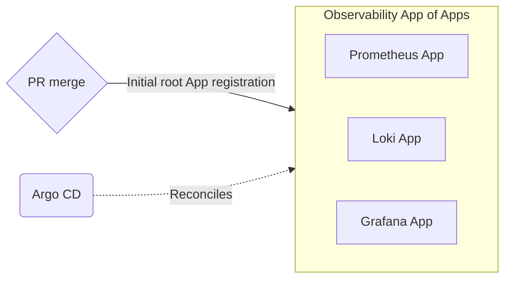

# Observability stack



## Components

- Prometheus
    - Metrics collection
    - Uses a minimal, bespoke deployment to avoid enterprise-level complexity for this tiny lab project
- Loki
    - Log aggregation
- Grafana
    - Visualization

> These are all given the `components.gke.io/gke-managed-components=true:NoSchedule` toleration so
> they can be scheduled on the infra node
> ...
> This is slightly gross given that these are not, in fact, `gke-managed-components`, but it is
> what it is
> Semantically, this taint marks my `infra` node pool, thus these workloads receive this
> toleration
> In a production setting, it would likely be desirable to have a `system` node pool for the GKE
> workloads and an `infra` node pool for the rest (or even break it down further), but budget is
> as budget does

## Directory structure

```text

observability/
  │
  ├─ root.yml       <- Root "App of Apps" Application template to register with Argo CD
  │
  ├─ app/           <- Root "App of Apps" helm chart
  │
  ├─ prometheus/    <- Prometheus-related templates to be watched by Argo
  │
  ├─ loki/          <- Loki-related templates to be watched by Argo
  │
  └─ grafana/       <- Grafana-related templates to be watched by Argo

```

> Argo watches the contents of `prometheus/`, `loki/`, and `grafana` on the `main` branch
> This is configured in the "App of Apps" under `app/` that is registered with `root.yml`
